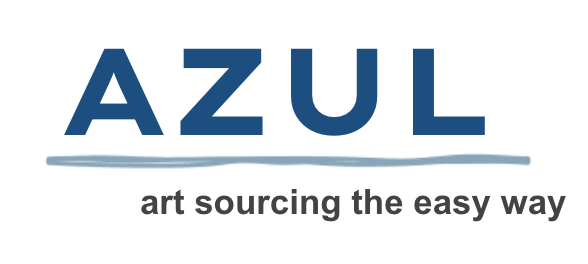

### Problem Space

As both an artist & art collector, art is something near and dear to my heart. I wanted to create a platform that showcases the value of art by connecting artists with a customer base.

### Tech Stack


### Before We Begin...

Please ensure you also use the [AZUL SERVER REPO](https://github.com/raquelpantin/azul-server) in order to access the server side of this application.

### Setup

Backend <br />  
[AZUL SERVER REPO](https://github.com/raquelpantin/azul-server), rename the .envexample to .env and add your MONGO_URI

```
# Backend
npm install
npm run server

# Frontend
cd frontend
npm install
npm start
```

### Connect With Me!

I hope you enjoyed the AZUL experience! If you have any questions or comments, I'd love to connect with you!

[Linkedin](https://www.linkedin.com/in/raquelpantin/) <br />

Email: raquel.pantin@gmail.com
