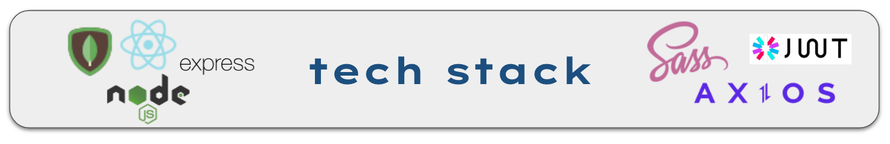

#### Problem Space

As both an artist & art collector, art is something near and dear to my heart. I wanted to create a platform that showcases the value of art by connecting artists with a customer base.

#### Tech Stack

#### Before We Begin...

Please ensure you also use the [AZUL SERVER REPO](https://github.com/raquelpantin/azul-server) in order to access the server side of this application.

## Available Scripts

In the project directory, you can run:

### `npm start`

Runs the app in the development mode.\
Open [http://localhost:3000](http://localhost:3000) to view it in your browser.

The page will reload when you make changes.\
You may also see any lint errors in the console.

### `npm test`

Launches the test runner in the interactive watch mode.\
See the section about [running tests](https://facebook.github.io/create-react-app/docs/running-tests) for more information.

#### Connect With Me!

I hope you enjoyed the AZUL experience! If you have any questions or comments, I'd love to connect with you!

[Linkedin](https://www.linkedin.com/in/raquelpantin/)
[Email](raquel.pantin@gmail.com)
